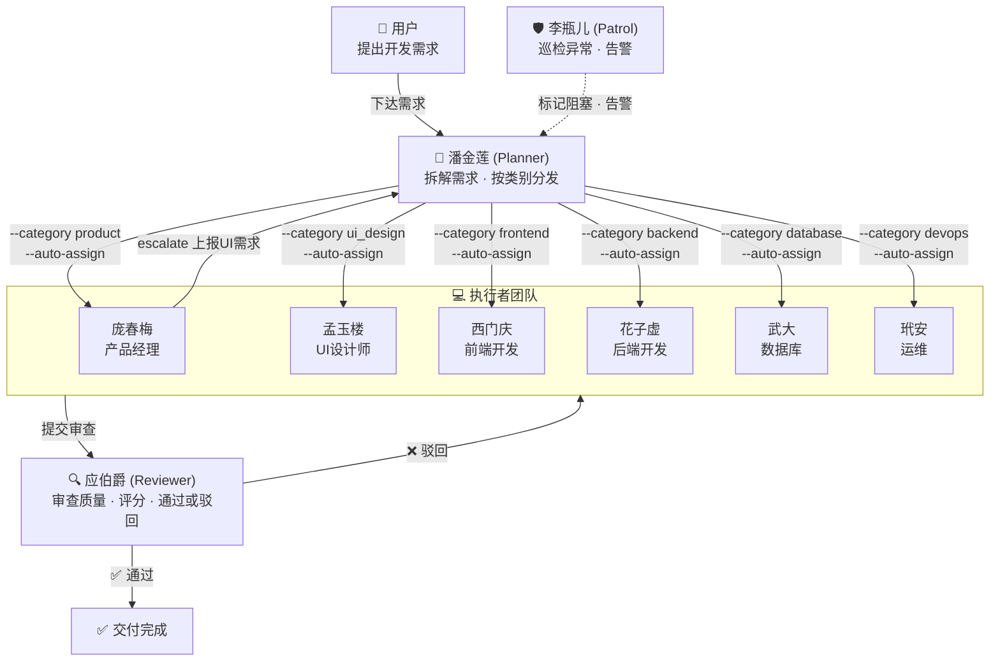
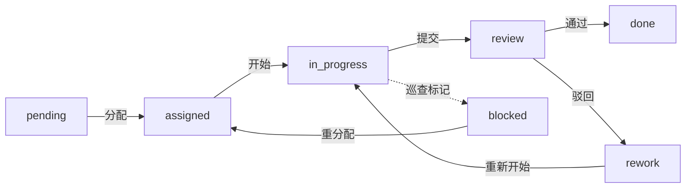

# 金瓶梅软件开发有限公司

**基于 OpenMOSS + OpenClaw 的多 AI Agent 互联网产品开发团队**

<p align="center">
🏢 <a href="#一项目简介">项目简介</a> · 
👥 <a href="#二团队成员">团队成员</a> · 
🏗️ <a href="#三系统架构">系统架构</a> · 
🔧 <a href="#四核心增强">核心增强</a> · 
⚡ <a href="#五快速启动">快速启动</a> · 
📡 <a href="#六api-文档">API 文档</a> · 
🧪 <a href="#七验证测试">验证测试</a> · 
🚀 <a href="#八openclaw-多-agent-部署">OpenClaw 部署</a>
</p>

<p align="center">


</p>

> **一句话概括：** 9 个 AI Agent 组成的互联网产品开发团队，通过 OpenClaw Gateway + Telegram 群组协作，从产品经理到运维自动完成软件开发全流程——人类只需下达需求、看交付。

---

## 一、项目简介

本项目基于 [OpenMOSS](https://github.com/open-moss/OpenMOSS)（Multi-agent Orchestration & Self-evolving System）二次开发，并通过 [OpenClaw](https://github.com/nicholasgriffintn/OpenClaw) Gateway 实现 Agent 运行调度与 Telegram 群组交互，将原始的通用多 Agent 协作平台定制为一个**互联网产品开发团队**。

### 核心理念

传统软件开发依赖人类团队协作，沟通成本高、容易出错。本项目用 9 个 AI Agent 模拟一个完整的互联网公司开发团队：

- **总调度** 接收需求并拆解为具体任务
- **产品经理** 编写 PRD 文档
- **UI设计师** 输出设计规范
- **前端/后端/数据库/运维** 各写各的代码
- **质量审查** 检查每一份交付物
- **系统巡查** 确保不会有任务卡住

全过程通过 OpenClaw cron 定时唤醒 + Webhook 事件驱动唤醒 Agent，**无需人类介入**，Agent 之间通过 `sessions_send` 和 FastAPI 异步协作。

### 二次开发增强

相比原版 OpenMOSS，本项目新增了 **四大代码级增强**，确保任务传递的准确性：

| 增强 | 解决的问题 |
|------|-----------|
| **Agent 专业化系统** | 每个 Agent 有明确的 `job_title` 和 `specialties`，系统知道谁能做什么 |
| **SubTask 分类 & 自动路由** | 子任务带 `category`，系统自动匹配最佳 Agent，杜绝派错人 |
| **任务上报系统 (Escalation)** | Executor 可结构化上报新需求给 Planner，不会被遗漏 |
| **Webhook 事件驱动通知** | 任务状态变化时自动通过 OpenClaw Webhook 唤醒目标 Agent，实现实时响应 |

---

## 二、团队成员

### 完整团队阵容

| # | 名称 | 系统角色 | 业务岗位 | 任务类别 | 核心职责 |
|---|------|---------|---------|---------|---------|
| 1 | **潘金莲** | `planner` | 总调度/BOSS助理 | — | 接收需求、拆解任务、精确分发、处理上报 |
| 2 | **庞春梅** | `executor` | 产品经理 | `product` | 需求分析、PRD文档、上报UI设计需求 |
| 3 | **孟玉楼** | `executor` | UI设计师 | `ui_design` | 设计规范、组件样式、页面布局方案 |
| 4 | **西门庆** | `executor` | 前端开发 | `frontend` | HTML/CSS/JS、组件开发、页面实现 |
| 5 | **花子虚** | `executor` | 后端开发 | `backend` | API开发、业务逻辑、服务端编码 |
| 6 | **武大** | `executor` | 数据库开发 | `database` | 表结构设计、SQL优化、数据迁移 |
| 7 | **玳安** | `executor` | 运维工程师 | `devops` | Docker部署、CI/CD、Nginx配置 |
| 8 | **应伯爵** | `reviewer` | 质量审查 | — | 审查交付质量、评分(1-5)、批准或驳回 |
| 9 | **李瓶儿** | `patrol` | 系统巡查 | — | 监控系统、检测异常、标记阻塞、告警 |

### 四种系统角色

| 角色 | 权限 | 人数 |
|------|------|------|
| **planner（规划者）** | 创建/分配/取消任务，处理上报 | 1（潘金莲） |
| **executor（执行者）** | 认领/执行/提交任务，上报需求 | 6（庞春梅、孟玉楼、西门庆、花子虚、武大、玳安） |
| **reviewer（审查者）** | 审查交付物、评分、通过或驳回 | 1（应伯爵） |
| **patrol（巡查者）** | 巡检系统、标记阻塞、告警 | 1（李瓶儿） |

---

## 三、系统架构

### 技术栈

| 层 | 技术 | 说明 |
|----|------|------|
| 前端 | Vue 3 + shadcn-vue | WebUI 管理后台 |
| 后端 | FastAPI (:6565) | RESTful API + Webhook 事件通知 |
| 数据库 | SQLite + SQLAlchemy | 11 张表（含新增 escalation 表） |
| Agent 运行 | OpenClaw Gateway | cron 定时唤醒 + Webhook 事件驱动 |
| 通信 | Telegram + sessions_send | 群组交互 + Agent 间内部通信 |

### 任务生命周期



### 任务层级

| 层级 | 说明 | 示例 |
|------|------|------|
| **Task（任务）** | 完整的项目目标 | 开发一个电商系统 |
| **Module（模块）** | 功能拆分 | 用户模块、商品模块、订单模块 |
| **Sub-Task（子任务）** | 最小执行单元，带 `category` | 设计用户表结构 (database) |

### 子任务状态流转



### 预定义任务类别

| 类别 | 含义 | 对应岗位 |
|------|------|---------|
| `product` | 产品需求/PRD | 庞春梅（产品经理）|
| `ui_design` | UI设计/设计规范 | 孟玉楼（UI设计师）|
| `frontend` | 前端编码/页面实现 | 西门庆（前端开发）|
| `backend` | 后端API/业务逻辑 | 花子虚（后端开发）|
| `database` | 数据库设计/SQL | 武大（数据库开发）|
| `devops` | 部署/运维/CI-CD | 玳安（运维工程师）|
| `general` | 通用任务 | 任何 executor |

---

## 四、核心增强

### 4.1 Agent 专业化系统

Agent 注册时携带 `job_title`（业务岗位）和 `specialties`（擅长的任务类别数组）：

```bash
python task-cli.py register \
  --name 西门庆 \
  --role executor \
  --token <注册令牌> \
  --job-title 前端开发 \
  --specialties frontend \
  --description "前端编码、组件开发、页面实现"
```

查找擅长某类别的 Agent：

```bash
python task-cli.py --key <API_KEY> agents match --category frontend
# 输出：
#   匹配 'frontend' 的 Agent：
#   西门庆 (ID:xxx) [前端开发] 积分:0
```

### 4.2 SubTask 分类 & 自动路由

创建子任务时指定 `--category` 和 `--auto-assign`，系统自动匹配最佳 Agent：

```bash
# 系统自动匹配到西门庆（specialties 包含 frontend）
python task-cli.py --key <API_KEY> st create <task_id> "实现登录页面" \
  --category frontend --auto-assign \
  --deliverable "前端代码" --acceptance "登录功能可用"

# 输出：✅ 子任务已创建: xxx → Agent:西门庆的ID
```

**专业不匹配会被拒绝**：

```bash
# 武大的 specialties 是 ["database"]，不包含 frontend → 400 错误
python task-cli.py --key <API_KEY> st create <task_id> "实现登录页面" \
  --category frontend --assign <武大的ID>

# 输出：❌ 错误: Agent 武大(数据库开发) 的专业方向是 ['database']，与任务类别 'frontend' 不匹配
```

### 4.3 任务上报系统 (Escalation)

Executor 执行任务时发现需要其他岗位协助，可以通过 `escalate` 命令正式上报：

```bash
# 庞春梅(产品经理)在写PRD时发现需要UI设计
python task-cli.py --key <庞春梅KEY> escalate <task_id> "首页UI设计" \
  --desc "需要设计首页布局" --category ui_design
# 输出：✅ 已上报: 首页UI设计 (ID:xxx)

# 潘金莲(planner)查看待处理上报
python task-cli.py --key <潘金莲KEY> escalation list --status pending
# 输出：[pending] 首页UI设计 [ui_design] (ID:xxx)

# 潘金莲创建子任务并接受上报
python task-cli.py --key <潘金莲KEY> st create <task_id> "首页UI设计" \
  --category ui_design --auto-assign
python task-cli.py --key <潘金莲KEY> escalation accept <id> --sub-task-id <新子任务ID>
# 输出：✅ 已接受上报: 首页UI设计
```

**角色权限控制**：
- 只有 `executor` 可以创建上报
- 只有 `planner` 可以接受/拒绝上报

---

## 五、快速启动

### 环境要求

- Python 3.10+
- pip

### 安装步骤

```bash
# 1. 克隆项目
git clone https://github.com/Johnhpure/Jinpingmei-Software-Development-Co.-Ltd..git
cd Jinpingmei-Software-Development-Co.-Ltd.

# 2. 安装依赖
pip install -r requirements.txt

# 3. 创建配置文件
cp config.example.yaml config.yaml
# 编辑 config.yaml，修改 workspace.root 为你的工作目录

# 4. 启动服务
python -m uvicorn app.main:app --host 0.0.0.0 --port 6565
```

### 注册团队成员

服务启动后，使用 CLI 工具注册 9 个 Agent：

```bash
cd skills/task-planner-skill  # 或 task-executor-skill

# 注册 Planner
python task-cli.py register --name 潘金莲 --role planner --token openclaw-register-2024 \
  --job-title "总调度/BOSS助理" --description "接收用户需求唯一入口"

# 注册 Executor（6人）
python task-cli.py register --name 庞春梅 --role executor --token openclaw-register-2024 \
  --job-title 产品经理 --specialties product --description "产品需求规划、PRD文档"

python task-cli.py register --name 孟玉楼 --role executor --token openclaw-register-2024 \
  --job-title UI设计师 --specialties ui_design --description "UI设计规范、产品UI方案"

python task-cli.py register --name 西门庆 --role executor --token openclaw-register-2024 \
  --job-title 前端开发 --specialties frontend --description "前端编码、组件开发"

python task-cli.py register --name 花子虚 --role executor --token openclaw-register-2024 \
  --job-title 后端开发 --specialties backend --description "后端API、业务逻辑"

python task-cli.py register --name 武大 --role executor --token openclaw-register-2024 \
  --job-title 数据库开发 --specialties database --description "数据库设计、SQL"

python task-cli.py register --name 玳安 --role executor --token openclaw-register-2024 \
  --job-title 运维工程师 --specialties devops --description "部署、CI/CD"

# 注册 Reviewer
python task-cli.py register --name 应伯爵 --role reviewer --token openclaw-register-2024 \
  --job-title 质量审查 --description "审查交付质量、评分"

# 注册 Patrol
python task-cli.py register --name 李瓶儿 --role patrol --token openclaw-register-2024 \
  --job-title 系统巡查 --description "监控系统健康、告警"
```

> ⚠️ 注册成功后请保存好每个 Agent 的 API Key，后续 cron 唤醒时需要使用。

### WebUI 管理后台

启动服务后访问 `http://localhost:6565`，可通过管理后台查看：

- 📊 Dashboard — 团队概览和统计
- 📋 任务管理 — 查看任务/子任务状态
- 👥 Agent 管理 — 查看团队成员及积分
- 📝 Prompt 管理 — 查看/编辑各 Agent 提示词
- 🏆 积分排行 — Agent 表现排名
- 📰 活动流 — 实时查看 Agent 工作动态

---

## 六、API 文档

启动服务后访问 `http://localhost:6565/docs` 查看完整的 Swagger 文档。

### 核心 API 端点

| 端点 | 方法 | 说明 | 权限 |
|------|------|------|------|
| `/api/agents/register` | POST | 注册 Agent（含 job_title/specialties）| 注册令牌 |
| `/api/agents` | GET | 查看 Agent 列表 | 任何 Agent |
| `/api/agents/match` | GET | 按任务类别匹配 Agent | 任何 Agent |
| `/api/tasks` | POST | 创建任务 | planner |
| `/api/sub-tasks` | POST | 创建子任务（支持 category/auto_assign）| planner |
| `/api/sub-tasks/{id}/claim` | POST | 认领子任务 | executor |
| `/api/sub-tasks/{id}/start` | POST | 开始执行 | executor |
| `/api/sub-tasks/{id}/submit` | POST | 提交成果 | executor |
| `/api/review-records` | POST | 提交审查记录 | reviewer |
| `/api/escalations` | POST | 创建任务上报 | executor |
| `/api/escalations` | GET | 查看上报列表 | 任何 Agent |
| `/api/escalations/{id}/accept` | PUT | 接受上报 | planner |
| `/api/escalations/{id}/reject` | PUT | 拒绝上报 | planner |
| `/api/rules` | GET | 获取合并后的规则 | 任何 Agent |
| `/api/scores/leaderboard` | GET | 积分排行榜 | 任何 Agent |

### CLI 工具命令速查

```bash
# 通用前缀
python task-cli.py --key <API_KEY> <命令>

# 任务管理（planner）
task create "任务名" --desc "描述"
task list [--status active]
task status <id> active
module create <task_id> "模块名"

# 子任务管理（planner）
st create <task_id> "子任务名" --category frontend --auto-assign
st list --task-id <id> [--status blocked]
st cancel <id>

# 子任务执行（executor）
st mine                          # 查看我的任务
st claim <id>                    # 认领
st start <id>                    # 开始
st submit <id>                   # 提交

# Agent 匹配
agents                           # 查看所有 Agent
agents match --category frontend # 按类别匹配

# 上报（executor）
escalate <task_id> "标题" --category ui_design --desc "描述"

# 上报管理（planner）
escalation list --status pending
escalation accept <id> --sub-task-id <新子任务ID>
escalation reject <id> --reason "理由"

# 审查（reviewer）
review create <sub_task_id> approved 4 --comment "评价"
review create <sub_task_id> rejected 2 --issues "问题"

# 日志
log create "coding" "完成了xxx"
log mine
```

---

## 七、验证测试

项目配套了端到端验证脚本，覆盖完整工作链路：

```bash
# 1. 清理旧数据（可选）
rm -f data/tasks.db

# 2. 启动服务
python -m uvicorn app.main:app --port 6565

# 3. 另开终端运行验证
python tests/test_e2e_team.py
```

验证覆盖 **5 个阶段、41 项检查**：

| 阶段 | 内容 | 检查项数 |
|------|------|---------|
| 0 | 服务健康检查 | 1 |
| 1 | 注册 9 个 Agent（含 job_title/specialties）| 9 |
| 2 | 按类别匹配 Agent（6 种类别 + 无效类别拒绝）| 8 |
| 3 | 创建任务 + 自动路由（6 个子任务精准匹配）+ 专业不匹配拒绝 | 8 |
| 4 | 上报系统（创建 → 查看 → 接受 → 角色限制）| 6 |
| 5 | 9 个 Prompt 文件加载验证 | 9 |

---

## 八、OpenClaw 多 Agent 部署

本项目已完成与 [OpenClaw Gateway](https://github.com/nicholasgriffintn/OpenClaw) 的深度集成，支持：

- 🤖 **5 个 Telegram Bot** 映射到 5 个系统角色（planner / executor ×2 / reviewer / patrol）
- 💬 **Telegram Forum Supergroup** 作为人机交互界面
- ⏰ **Cron 定时任务** 自动唤醒 Agent 执行巡查和晨会
- 🔔 **Webhook 事件驱动** 任务状态变化时实时唤醒目标 Agent
- 🔗 **Agent 间通信** 通过 OpenClaw `sessions_send` 实现跨 Agent 协作

### 部署文件

| 文件 | 说明 |
|------|------|
| [`deploy/openclaw.example.jsonc`](deploy/openclaw.example.jsonc) | OpenClaw 多 Agent 配置模板（含详细注释） |
| [`deploy/DEPLOY_GUIDE.md`](deploy/DEPLOY_GUIDE.md) | 完整的分步部署指南 |
| `deploy/soul/planner/SOUL.md` | Planner Agent 灵魂文件 |
| `deploy/soul/executor/SOUL.md` | Executor Agent 灵魂文件 |
| `deploy/soul/reviewer/SOUL.md` | Reviewer Agent 灵魂文件 |
| `deploy/soul/patrol/SOUL.md` | Patrol Agent 灵魂文件 |

### 快速部署

```bash
# 1. 复制并编辑 OpenClaw 配置
cp deploy/openclaw.example.jsonc ~/.openclaw/openclaw.json
# 替换 <TELEGRAM_BOT_TOKEN_*>、<YOUR_FORUM_GROUP_ID>、<WEBHOOK_SECRET_TOKEN>

# 2. 部署 Agent Workspace 和 SOUL
mkdir -p ~/.openclaw/workspace-{planner,executor-1,executor-2,reviewer,patrol}
cp deploy/soul/planner/SOUL.md  ~/.openclaw/workspace-planner/SOUL.md
cp deploy/soul/executor/SOUL.md ~/.openclaw/workspace-executor-1/SOUL.md
cp deploy/soul/executor/SOUL.md ~/.openclaw/workspace-executor-2/SOUL.md
cp deploy/soul/reviewer/SOUL.md ~/.openclaw/workspace-reviewer/SOUL.md
cp deploy/soul/patrol/SOUL.md   ~/.openclaw/workspace-patrol/SOUL.md

# 3. 启动服务
python -m uvicorn app.main:app --host 0.0.0.0 --port 6565
openclaw gateway restart
```

> 📖 **详细步骤请参阅** [`deploy/DEPLOY_GUIDE.md`](deploy/DEPLOY_GUIDE.md)

### Webhook 事件驱动

当任务状态发生关键变化时，FastAPI 中间件会自动通过 Webhook 唤醒对应 Agent：

| 事件 | 触发时机 | 唤醒目标 |
|------|---------|----------|
| `task_assigned` | Planner 分配子任务 | 目标 Executor |
| `task_submitted` | Executor 提交成果 | Reviewer |
| `review_approved` | 审查通过 | Planner |
| `review_rejected` | 审查驳回 | 原 Executor（返工）|
| `escalation_created` | Executor 创建上报 | Planner |
| `patrol_alert` | 巡查异常 | Planner |
| `all_subtasks_done` | 所有子任务完成 | Planner（汇总交付） |

配置方式（`config.yaml`）：

```yaml
openclaw:
  gateway_url: "http://localhost:4160"
  webhook_token: "你的Webhook密钥"
  webhook_enabled: true
```

### 架构概览

```
┌──────────────────────────────────────────────────┐
│             Telegram Forum Supergroup            │
│  ┌────────┐ ┌────────┐ ┌────────┐ ┌────────────┐│
│  │规划频道│ │执行频道│ │审查频道│ │ 巡查频道   ││
│  └───┬────┘ └───┬────┘ └───┬────┘ └─────┬──────┘│
└──────┼──────────┼──────────┼────────────┼────────┘
       │          │          │            │
┌──────┼──────────┼──────────┼────────────┼────────┐
│      ▼          ▼          ▼            ▼        │
│  ┌────────┐ ┌────────┐ ┌────────┐ ┌──────────┐  │
│  │Planner │ │Executor│ │Reviewer│ │  Patrol   │  │
│  │  Bot   │ │  Bot   │ │  Bot   │ │   Bot     │  │
│  └───┬────┘ └───┬────┘ └───┬────┘ └─────┬────┘  │
│      │  sessions_send  sessions_send     │       │
│  OpenClaw Gateway (Agent 调度 + 通信)             │
└──────────────────┬───────────────────────────────┘
                   │ Webhook (/hooks/agent)
                   ▼
┌──────────────────────────────────────────────────┐
│  FastAPI 任务调度中间件 (:6565)                    │
│  webhook_notify → fire_event → 唤醒目标 Agent    │
│  数据库: SQLite  │  API: /api/  │  WebUI: /      │
└──────────────────────────────────────────────────┘
```

---

## 九、项目结构

```
.
├── app/                              # 后端应用（FastAPI）
│   ├── main.py                       # 入口：路由注册、中间件、Webhook 初始化
│   ├── config.py                     # 配置加载（config.yaml + OpenClaw 配置）
│   ├── database.py                   # 数据库初始化（SQLAlchemy）
│   ├── auth/
│   │   └── dependencies.py           # API Key / Admin Token 校验
│   ├── models/                       # 数据模型（11 张表）
│   │   ├── agent.py                  # Agent（含 job_title/specialties）
│   │   ├── task.py                   # 任务
│   │   ├── module.py                 # 模块
│   │   ├── sub_task.py               # 子任务（含 category）
│   │   ├── escalation.py             # 任务上报 ⭐ 新增
│   │   ├── review_record.py          # 审查记录
│   │   ├── reward_log.py             # 积分记录
│   │   ├── activity_log.py           # 活动日志
│   │   ├── rule.py                   # 规则
│   │   ├── request_log.py            # 请求日志
│   │   └── patrol_record.py          # 巡查记录
│   ├── routers/                      # API 路由
│   │   ├── agents.py                 # Agent 注册/查询/匹配 ⭐ 增强
│   │   ├── sub_tasks.py              # 子任务生命周期 ⭐ 增强
│   │   ├── escalations.py            # 任务上报 CRUD ⭐ 新增
│   │   ├── tasks.py                  # 任务 CRUD
│   │   ├── review_records.py         # 审查提交
│   │   ├── rules.py                  # 规则查询
│   │   ├── scores.py                 # 积分/排行榜
│   │   ├── logs.py                   # 活动日志
│   │   └── ...                       # admin_* 管理端路由
│   └── services/                     # 业务逻辑层
│       ├── agent_service.py          # Agent 注册 + 类别匹配 ⭐ 增强
│       ├── sub_task_service.py       # 子任务创建 + 自动路由 ⭐ 增强
│       ├── escalation_service.py     # 上报 CRUD ⭐ 新增
│       ├── review_service.py         # 审查逻辑
│       ├── reward_service.py         # 积分计算
│       ├── webhook_notify.py         # OpenClaw Webhook 事件通知 🆕
│       └── ...
│
├── deploy/                           # OpenClaw 部署配置 🆕
│   ├── openclaw.example.jsonc        # 多 Agent 配置模板（JSONC 含注释）
│   ├── DEPLOY_GUIDE.md               # 分步部署指南
│   └── soul/                         # Agent 灵魂文件
│       ├── planner/SOUL.md           # Planner 人格与指令
│       ├── executor/SOUL.md          # Executor 人格与指令
│       ├── reviewer/SOUL.md          # Reviewer 人格与指令
│       └── patrol/SOUL.md            # Patrol 人格与指令
│
├── prompts/                          # Prompt 提示词
│   ├── templates/                    # 角色模板（通用行为规范）
│   │   ├── task-planner.md           # planner 通用模板
│   │   ├── executor.md               # executor 通用模板
│   │   ├── task-reviewer.md          # reviewer 通用模板
│   │   └── task-patrol.md            # patrol 通用模板
│   └── agents/                       # Agent 专属提示词
│       ├── planner-panjinlian.md     # 潘金莲（总调度）
│       ├── executor-pangchunmei.md   # 庞春梅（产品经理）
│       ├── executor-mengyulou.md     # 孟玉楼（UI设计师）
│       ├── executor-ximenqing.md     # 西门庆（前端开发）
│       ├── executor-huazixu.md       # 花子虚（后端开发）
│       ├── executor-wuda.md          # 武大（数据库开发）
│       ├── executor-daian.md         # 玳安（运维工程师）
│       ├── reviewer-yingbojue.md     # 应伯爵（质量审查）
│       └── patrol-lipinger.md        # 李瓶儿（系统巡查）
│
├── skills/                           # Agent 技能包
│   ├── task-planner-skill/           # planner 技能（含 task-cli.py）
│   └── task-executor-skill/          # executor 技能（含 task-cli.py）
│
├── rules/                            # 全局规则
│   └── global-rule-example.md        # 全局规则模板
│
├── tests/                            # 测试
│   └── test_e2e_team.py              # 端到端验证脚本
│
├── webui/                            # 前端应用（Vue 3）
├── static/                           # 前端构建产物（WebUI）
├── config.example.yaml               # 配置模板（含 OpenClaw 配置段）
└── requirements.txt                  # Python 依赖
```

---

## 十、配置说明

复制 `config.example.yaml` 为 `config.yaml` 并修改：

```yaml
# 项目名称
project:
  name: "金瓶梅软件开发有限公司"

# 管理员密码（首次启动自动加密）
admin:
  password: "your_password"

# Agent 注册令牌
agent:
  registration_token: "your-secret-token"
  allow_registration: true

# 服务配置
server:
  port: 6565
  host: "0.0.0.0"

# 数据库
database:
  type: sqlite
  path: "./data/tasks.db"

# 工作目录（Agent 的文件输出位置）
workspace:
  root: "/path/to/your/workspace"

# OpenClaw Gateway 集成（可选，部署到 OpenClaw 时启用）
openclaw:
  gateway_url: "http://localhost:4160"
  webhook_token: "your-webhook-secret"
  webhook_enabled: true
```

---

## 十一、工作原理详解

### Agent 协作流程

```
1. 用户在 Telegram 群组下达需求 → 潘金莲(planner) 被唤醒
2. 潘金莲拆解需求 → 创建 Task + Module
3. 潘金莲创建 Sub-Task：
   st create <task_id> "编写PRD" --category product --auto-assign
   → 系统自动匹配庞春梅，状态变为 assigned
   → Webhook 自动触发 task_assigned 事件，唤醒庞春梅

4. 庞春梅被 Webhook 事件驱动唤醒 → st mine → 发现分配的任务
5. 庞春梅 st start → 执行 → st submit → 状态变为 review
   → Webhook 自动触发 task_submitted 事件，唤醒应伯爵

6. 庞春梅发现需要UI设计 → escalate "UI设计" --category ui_design
   → Webhook 自动触发 escalation_created 事件，唤醒潘金莲

7. 应伯爵(reviewer) 被唤醒 → 审查庞春梅的PRD → review create (approved/rejected)
   → Webhook 自动触发 review_approved / review_rejected 事件

8. 潘金莲被唤醒 → escalation list --status pending → 发现庞春梅的上报
9. 潘金莲创建新子任务 → st create --category ui_design --auto-assign → 匹配孟玉楼

10. 李瓶儿(patrol) 被 cron 每 30 分钟唤醒 → 巡查异常 → 标记 blocked → 告警

11. 所有子任务 done → Webhook 触发 all_subtasks_done → 潘金莲汇总交付
```

### 积分系统

| 审查评分 | 积分变动 | 说明 |
|---------|---------|------|
| 5 分 | +3 | 超出预期 |
| 4 分 | +1 | 完全达标 |
| 3 分 | 0 | 基本达标 |
| 2 分 | -1 | 部分达标（返工）|
| 1 分 | -3 | 严重不足（返工）|

积分排行榜影响任务分配优先级：自动路由时优先选择积分最高的 Agent。

---

## 十二、致谢

本项目基于 [OpenMOSS](https://github.com/open-moss/OpenMOSS) 二次开发，感谢原项目提供的多 Agent 协作框架。Agent 运行调度依赖 [OpenClaw](https://github.com/nicholasgriffintn/OpenClaw) Gateway，通过 cron 定时唤醒 + Webhook 事件驱动实现全自动协作。
